# Git Practice

## Main

### Lesson 1
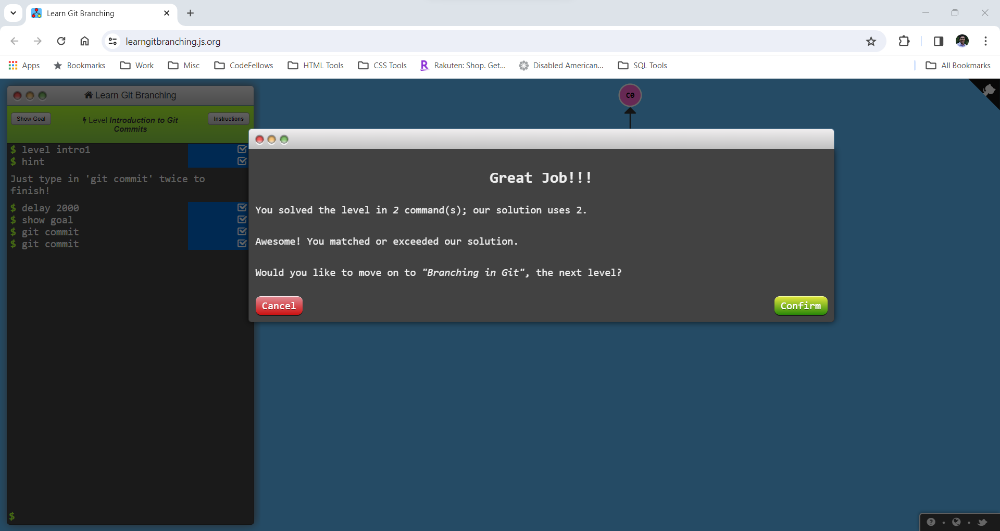
### Lesson 2
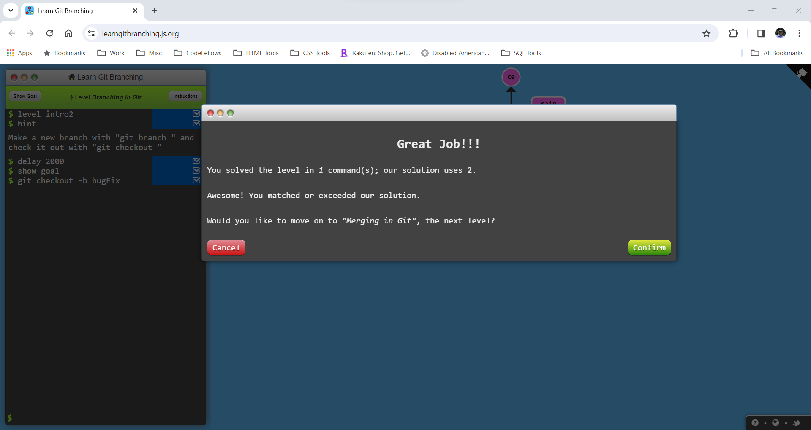
### Lesson 3
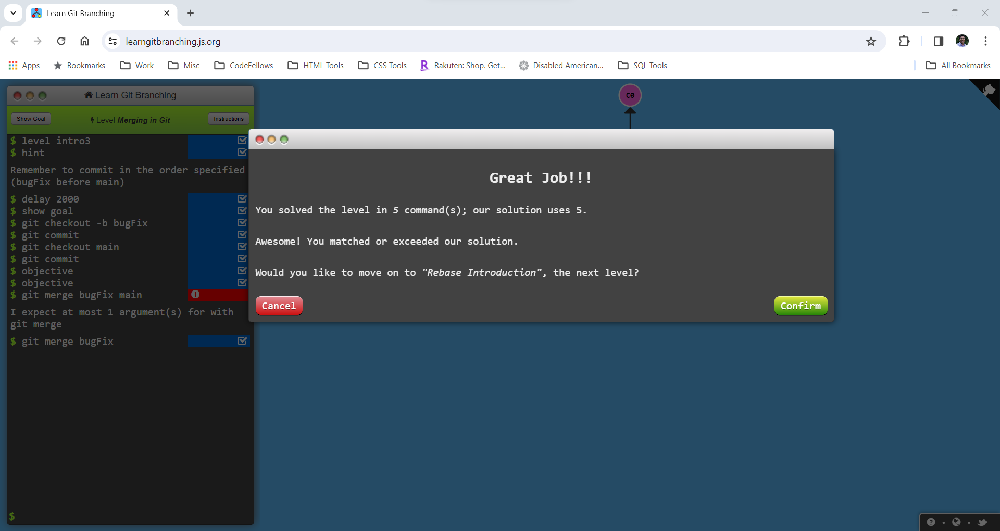
### Lesson 4

### Lesson 5

### Lesson 6
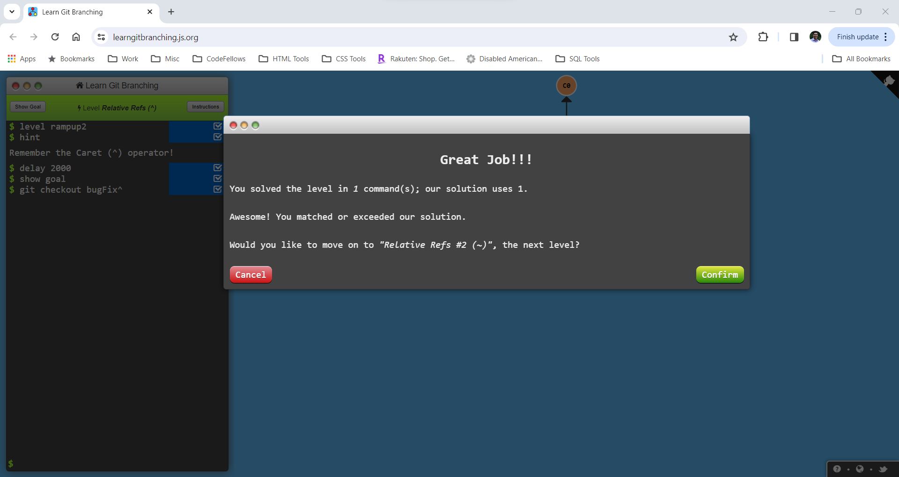
### Lesson 7
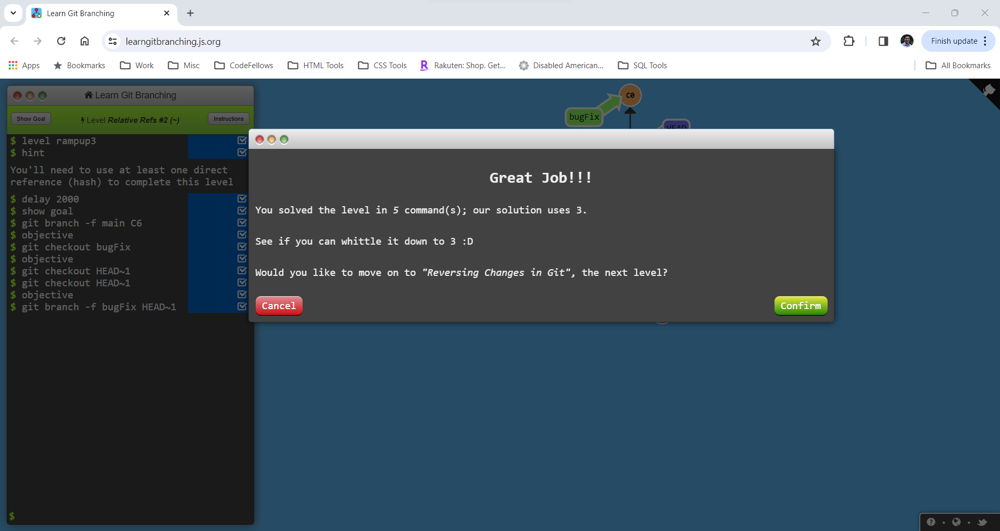
### Lesson 8

### Lesson 9

### Lesson 10
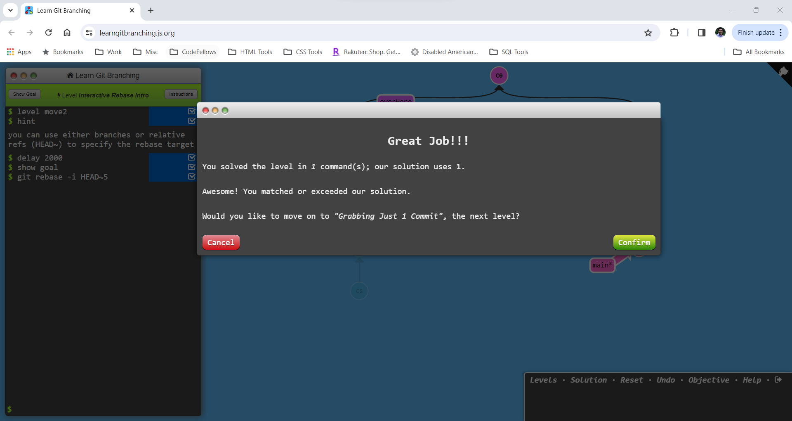
### Lesson 11

### Lesson 12

### Lesson 13

### Lesson 14
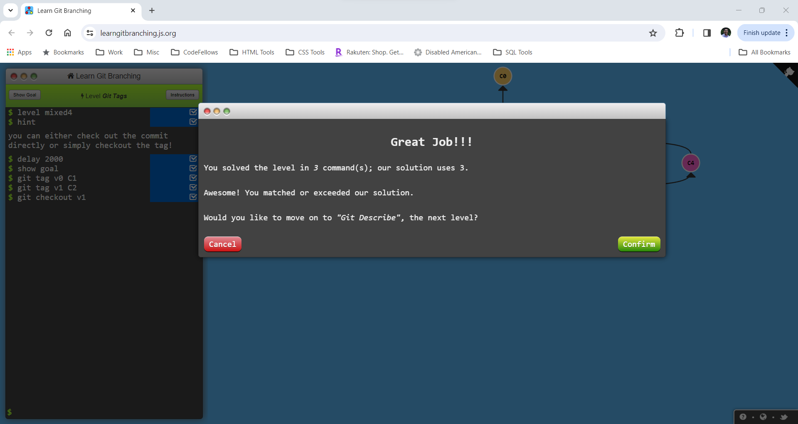
### Lesson 15
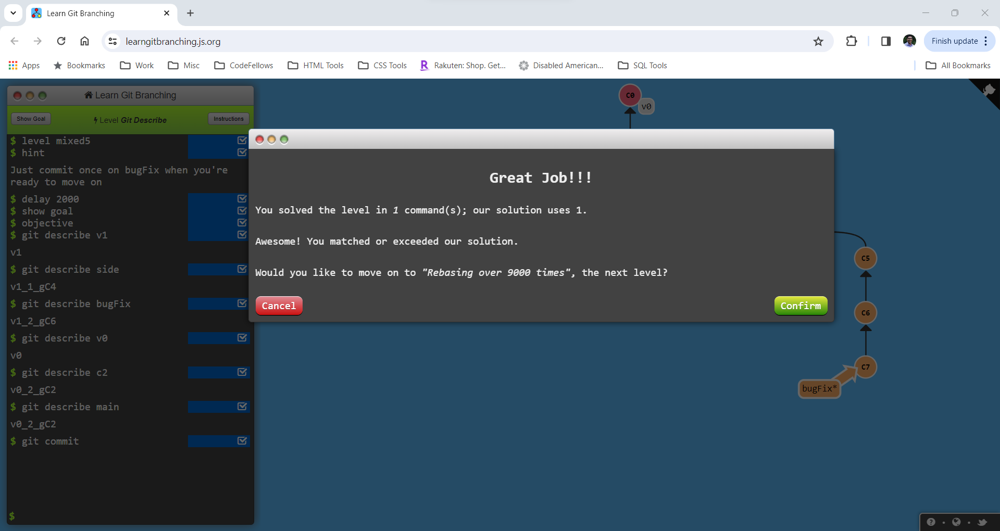
### Lesson 16
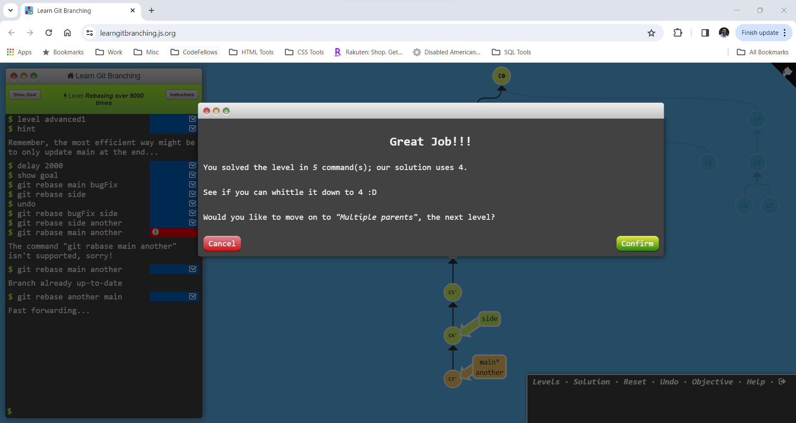
### Lesson 17

### Lesson 18

## Remote

### Lesson 1
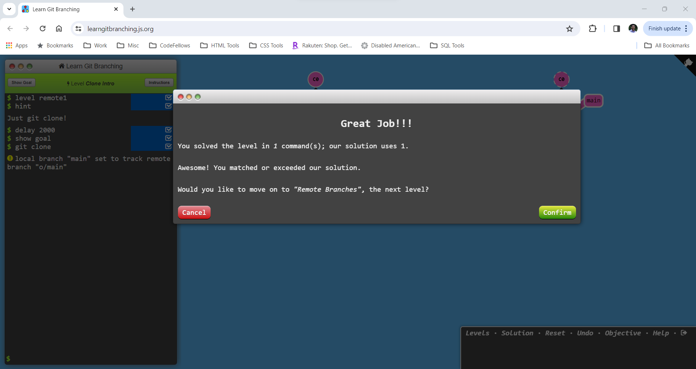
### Lesson 2
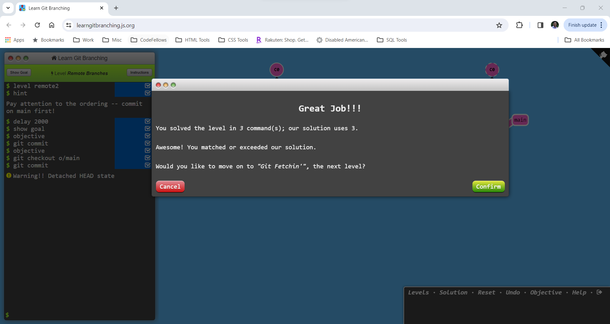
### Lesson 3
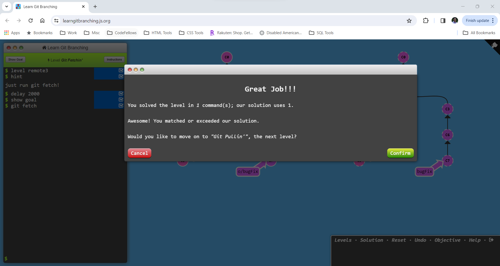
### Lesson 4

### Lesson 5
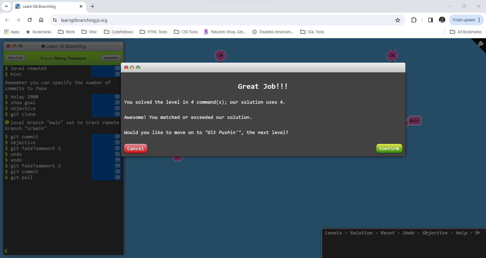
### Lesson 6
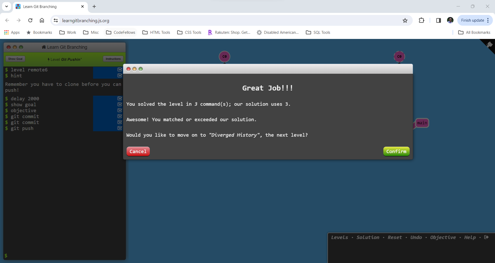
### Lesson 7
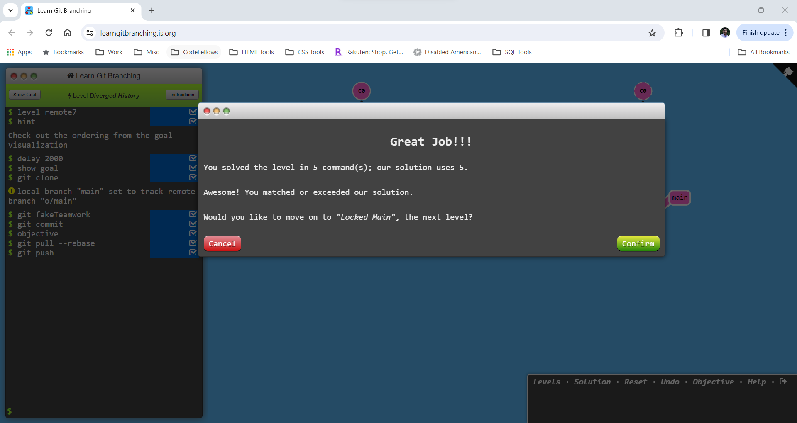
### Lesson 8
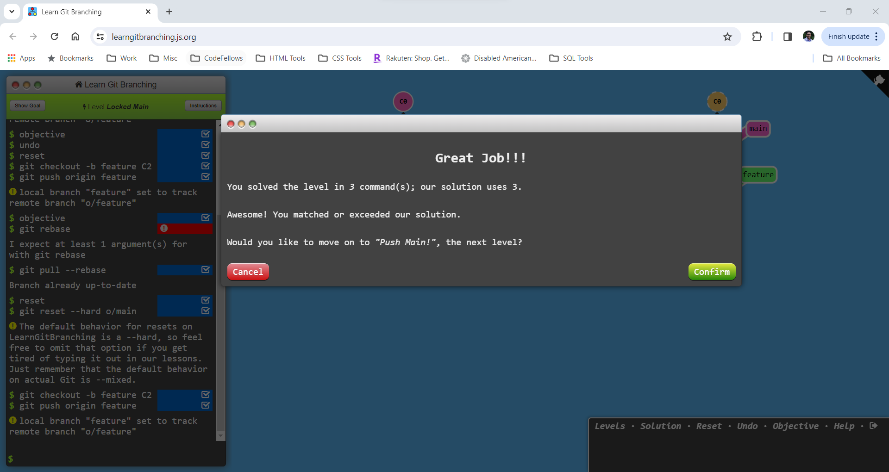
### Lesson 9

### Lesson 10

### Lesson 11

### Lesson 12

### Lesson 13
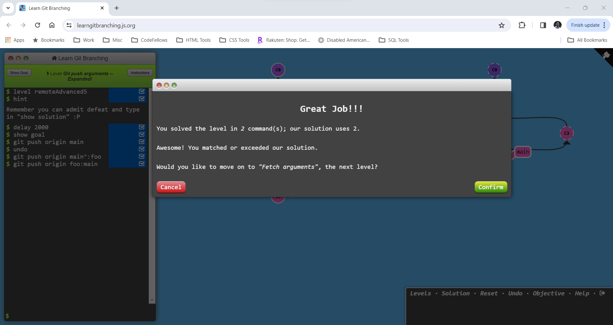
### Lesson 14

### Lesson 15

### Lesson 16
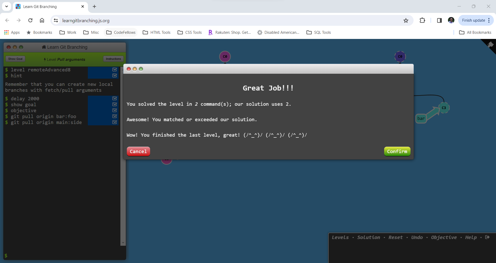