# SQL Intro

## Directions for assignment submission:
When you are finished with all of the lessons, create a new entry in your reading notes repository summarizing your understanding of relational databases and SQL. Include all of your screen shots in this page.

Submit a link to your rendered notes page.

## Notes
- Structure Query Language (SQL)
- SQL enables a user to create, use and manage a database
- Also enables to perform queries and retrive data out of a database
- Common databases are Oracle, SQL Server, MySQL, Sybase and PostgreSQL
- Each is maintained by different organizations and optimized for different uses
- Each has same basic syntax with varying differences in advanced syntax
- A table is a database set of rows and columns and each row is an instance of the entity in the table and each column is a property of that instance
- A database schema describes the structure of the table and the datatypes for each column
- Basic SQL commands:
```INSERT: adds data```
```SELECT: retrieve data```
```DELETE: delete data```
```UPDATE: modify exisiting data```
- Before updating and deleting a row of data, use a select and where statement to ensure you're targeting the correct row of data
- Format for a SQL query
1. SELECT statement to declare what data to search for
2. FROM statement to declare where to search
3. Optional statement to delcare how to transform the data

## Directions for assignment submission:
For each of the tutorial sections:

Read the guidance.
Complete the exercises.
Capture a screen shot of the completed task list.

### Lesson 1
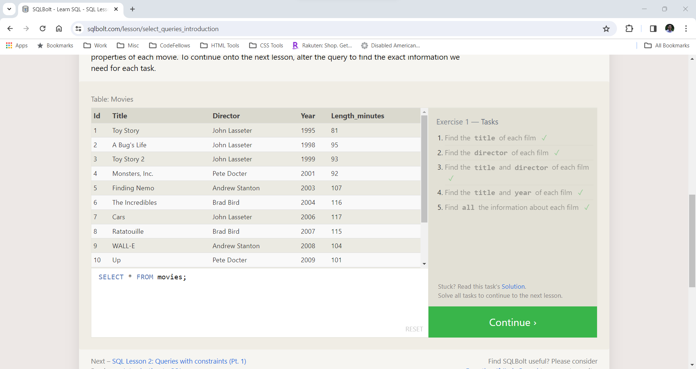
### Lesson 2
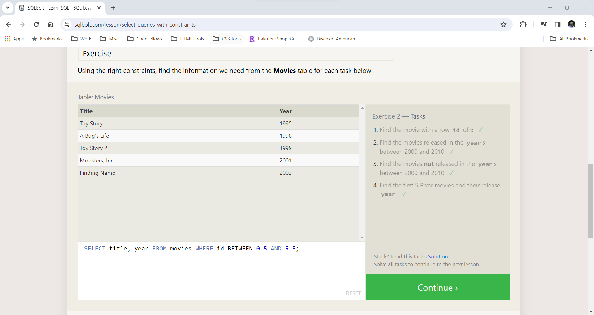
### Lesson 3
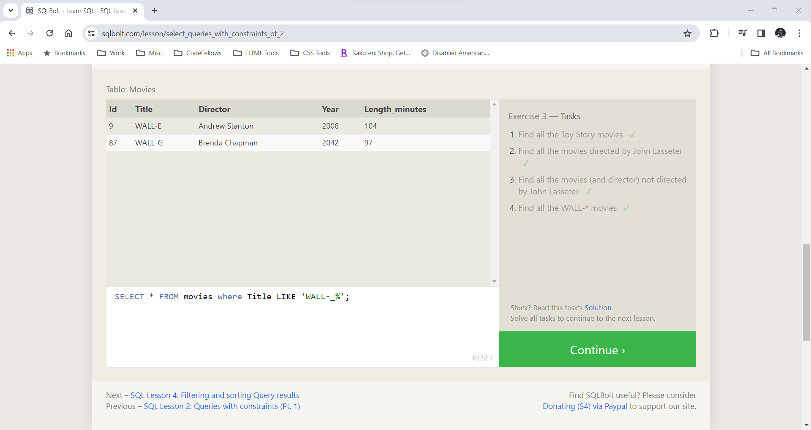
### Lesson 4
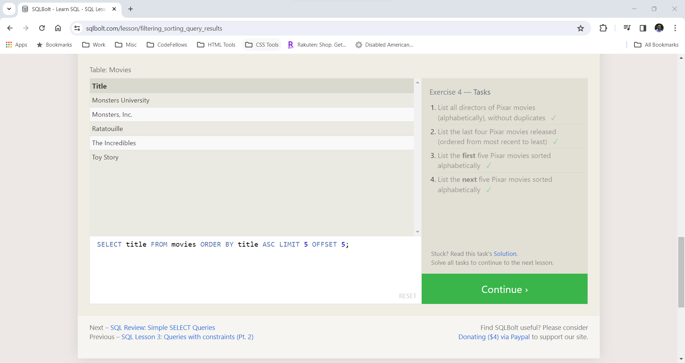
### Lesson 5
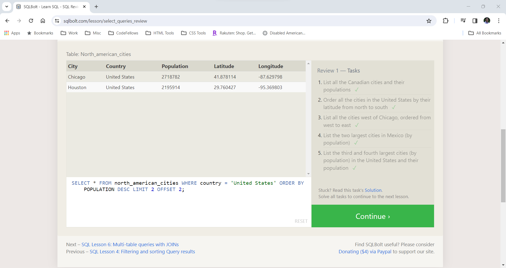
### Lesson 6
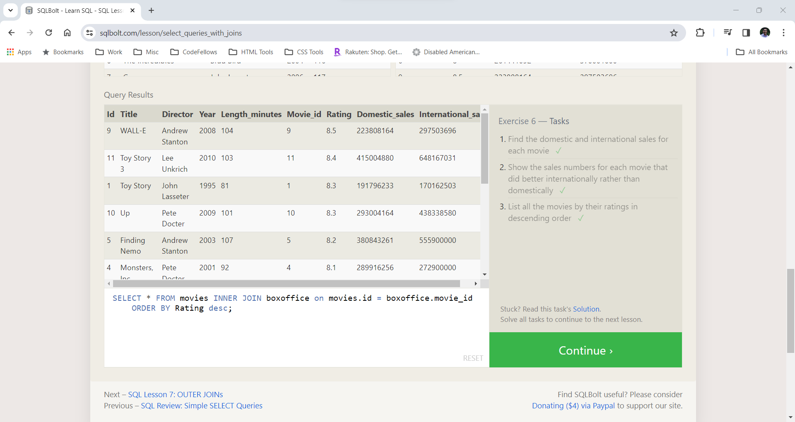
### Lesson 13
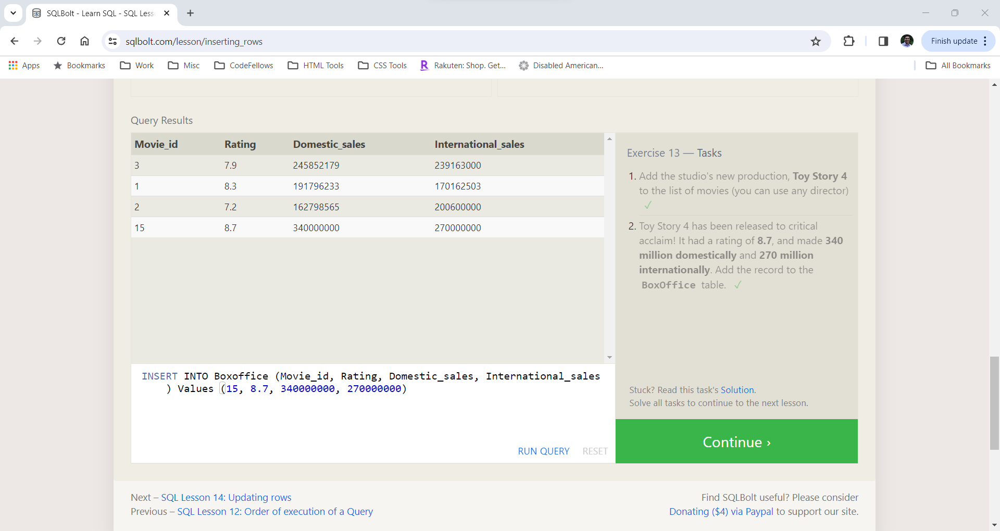
### Lesson 14
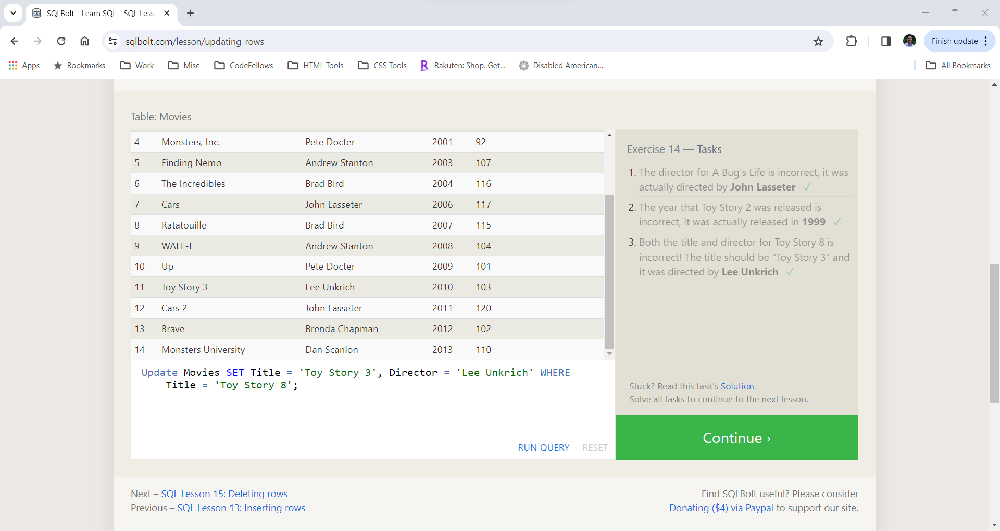
### Lesson 15
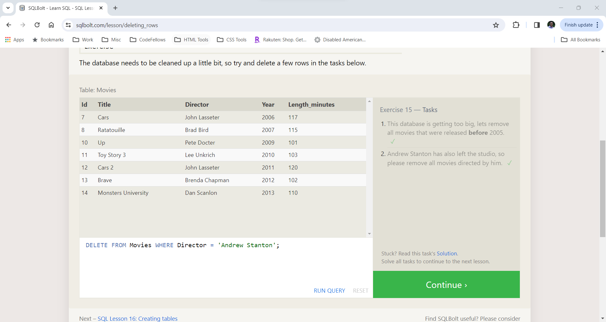
### Lesson 16
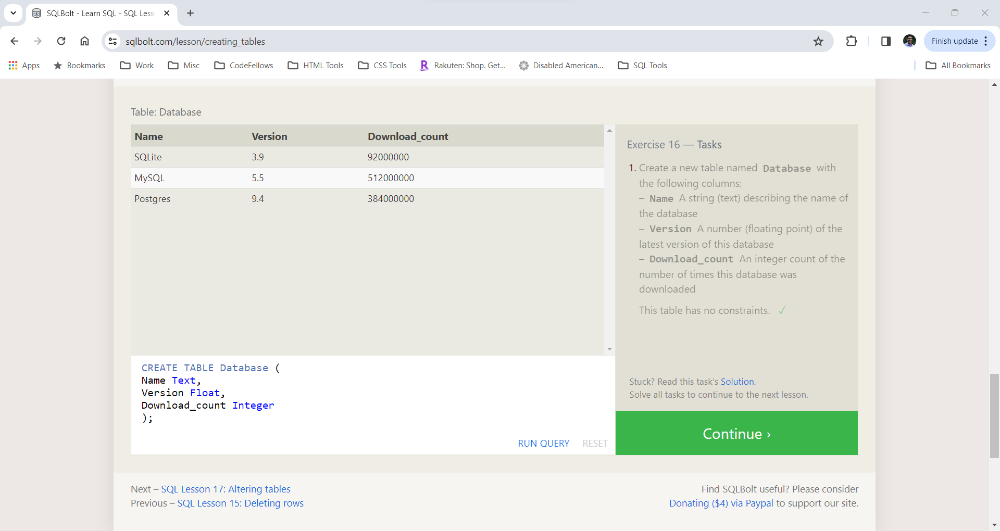
### Lesson 17
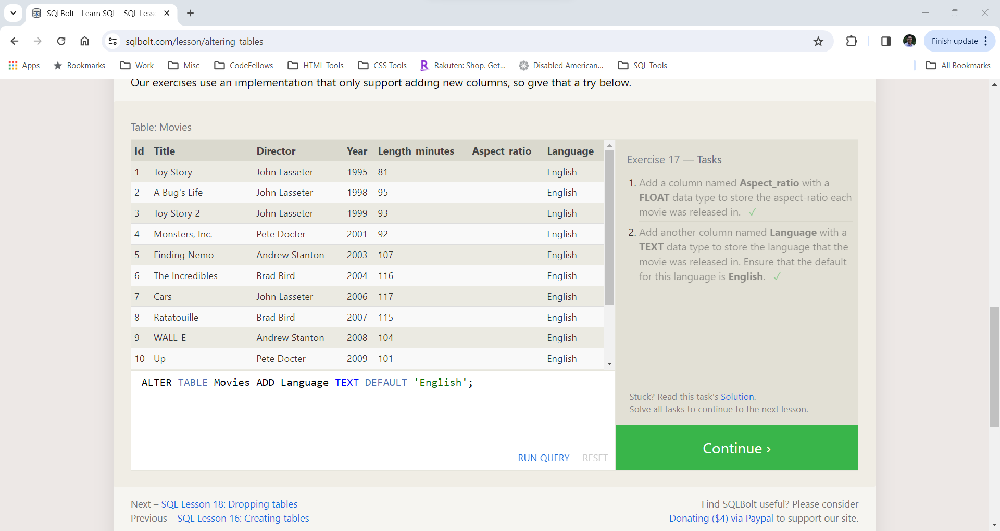
### Lesson 18
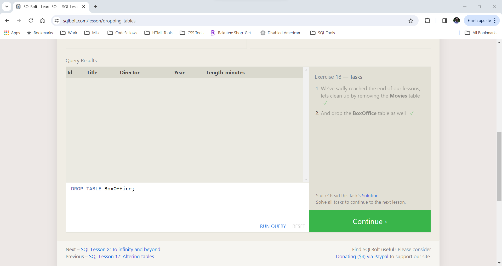